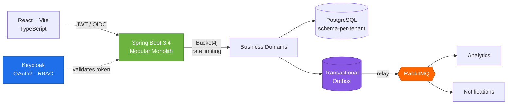
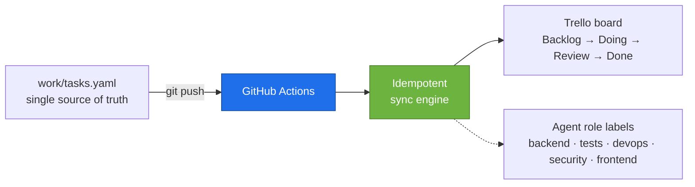

<div align="center">


<a href="https://github.com/danilofranco1990"></a>
<a href="README.pt-BR.md"></a>

<br/><br/>


<br/>

<a href="https://www.linkedin.com/in/danilo-franco-852a4841/"></a>
<a href="mailto:danilo.franco90@gmail.com"></a>


</div>

---

## Who I am

Backend engineer with **5+ years dedicated to Java and the Spring ecosystem**, inside a **10+ year trajectory in tech** — from IT support to software engineering and architecture.

I currently build and maintain a **high-criticality government platform used by every public health surveillance unit in the State of São Paulo**, and I architected a **multi-tenant B2B SaaS end-to-end** — from schema-per-tenant isolation and asynchronous event pipelines to OAuth2 security and CI/CD.

What I care about: turning complex business rules into architectures that survive change. Transactional integrity, resilience, observability, and code that the next engineer can actually maintain.

<div align="center">

| | | |
|:---:|:---:|:---:|
| **5+** | **10+** | **100+** |
| years of Java & Spring | years in technology | sales reps served by a system I owned alone |

</div>

---

## What I've built

<table>
<tr>
<td width="33%" valign="top">

### 🏛️ SIVISA
**Health Surveillance Information System — State of São Paulo**

Mission-critical government platform used by **every health surveillance unit in the state**. I engineer and maintain it, guaranteeing availability and data integrity.

Built the **reporting module** that expanded the field teams' ability to extract and analyze data, and modernized legacy Java / Spring Boot applications to cut complexity.

`Java` `Spring Boot` `Oracle` `REST`

</td>
<td width="33%" valign="top">

### 📦 National Sales Force
**Ilumi Materiais Elétricos**

Invited to take over — as the company's **only developer, with no technical supervision** — the sales force system used by **100+ commercial representatives across Brazil**.

Full ownership of operation, maintenance and evolution. Built critical commercial and financial routines with a focus on reliability and transactional integrity.

`Java SE/EE` `SQL Server` `Full ownership`

</td>
<td width="33%" valign="top">

### 🚀 InsightFlow
**B2B Sales Intelligence SaaS** · `Private`

Personal project, architected and developed **end-to-end**: multi-tenant platform with schema-per-tenant isolation, asynchronous event pipeline and multi-tenant security.

Proprietary code — architecture detailed below.

`Java 21` `Spring Boot 3.4` `RabbitMQ` `Keycloak`

</td>
</tr>
</table>

---

## Architecture in focus — InsightFlow

The problem: serve multiple client companies from one platform, with **hard data isolation**, **reliable event delivery** between ingestion, analytics and notifications, and **no dual-write between database and message broker**.



**Decisions worth defending in an interview:**

| Decision | Why |
|---|---|
| **Modular monolith** over microservices | Domain boundaries without distributed-systems overhead at this stage. Modules can be extracted later — the seams are already there. |
| **Schema-per-tenant** | Real isolation at the database level, without the operational cost of a database per client. |
| **Transactional Outbox** | Kills the dual-write problem: the event is committed in the same transaction as the data, then relayed. No lost or phantom events. |
| **Keycloak / OAuth2-OIDC** | Identity as infrastructure, not application code. RBAC per tenant with no auth logic scattered across domains. |
| **Bucket4j rate limiting** | Protects shared resources from any single tenant degrading the others. |
| **Flyway + Caffeine L2** | Versioned, reproducible migrations across every tenant schema; cache to cut database pressure on hot reads. |

`Stripe` billing · `Docker` containerization · `GitHub Actions` CI/CD for build, test and deploy.

---

## AI agent engineering

I don't just *use* AI tooling — I build it. My angle is the engineer's, not the user's: **orchestration, idempotency, secret handling and reproducible pipelines** applied to agent-driven development workflows.

**Authored Claude Code skills** — `trello-init` / `trello-sync`: a Trello ⇄ Spec-Driven Development integration that keeps a project board in sync from the repository itself.



**Engineering choices inside it:**

- **Idempotent by design** — reruns converge to the same state instead of duplicating cards; provisioning aborts on an existing link unless explicitly forced.
- **Secrets stay out of the automation** — the script never writes credentials. Registering repository secrets is a deliberate manual step; the committed link file holds IDs only.
- **Concurrency control** — the workflow serializes runs per ref, so rapid successive pushes can't race each other into a corrupted board.
- **Runs where the runner can see it** — sync engine and workflow are vendored into the repository, not the local agent config, so CI is the execution environment.
- **Agent roles as first-class labels** — work is routed by specialty (backend, testing, release/devops, security review, frontend) instead of one undifferentiated assistant.

---

## Tech stack

<div align="center">

**Languages & Frameworks**


**Architecture & Design**


**Data & Messaging**


**Security & Auth**


**DevOps & Quality**


</div>

---

## Trajectory

```
2011 ──── 2012 ──────── 2017 ──── 2018 ──────── 2021 ──── 2021 ─────────────► now
  │         │             │         │             │
  IT        IT            ↓         IT Analyst    ↓        Backend Engineer
  Intern    Assistant               Java Dev               Java · Spring
  │         │                       │                      │
  └─ Ilumi Materiais Elétricos ─────┴──────────────────────┴─ Stefanini Group
```

A decade of climbing from support to engineering. I know what breaks in production because I used to be the one they called when it broke.

**Education**


**Languages** — Portuguese (native) · English (technical reading and conversational comprehension; speaking in progress)

---

## GitHub

<p align="center">
  
</p>

> Most of my work lives in private and corporate repositories — government systems and proprietary SaaS code. The architecture above is the honest picture of what I build.

---

<div align="center">

### Let's talk

I'm open to backend engineering opportunities where architecture, reliability and ownership actually matter.

<a href="https://www.linkedin.com/in/danilo-franco-852a4841/"></a>
<a href="mailto:danilo.franco90@gmail.com"></a>


</div>
