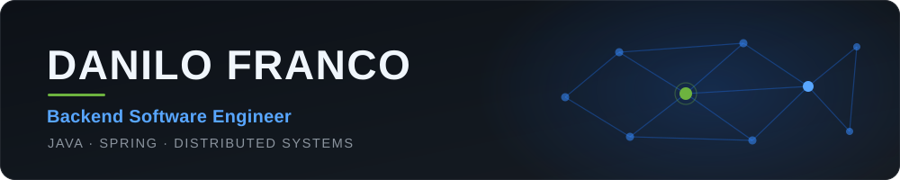
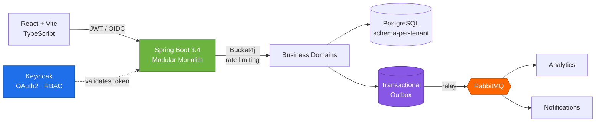
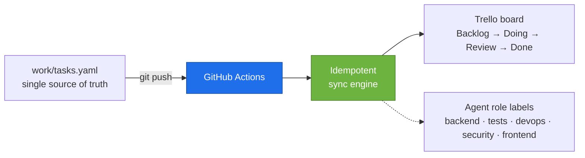

<picture>
  <source media="(prefers-color-scheme: dark)" srcset="assets/banner-dark.svg" />
  <source media="(prefers-color-scheme: light)" srcset="assets/banner-light.svg" />
  
</picture>

  

&nbsp;&nbsp;

  

 

Backend engineer with **5+ years dedicated to Java and the Spring ecosystem**, inside a 10+ year trajectory that started in IT support.

Today I build and maintain a **high-criticality government platform used by every public health surveillance unit in the State of São Paulo**, and I architected a **multi-tenant B2B SaaS end-to-end** — from schema-per-tenant isolation to event pipelines, OAuth2 and CI/CD.

What I care about: turning complex business rules into architectures that survive change. Transactional integrity, resilience, and code the next engineer can actually maintain.

**5+** years of Java & Spring&nbsp; · &nbsp;**10+** years in tech&nbsp; · &nbsp;**100+** sales reps served by a system I owned alone

 

## What I've built

🏛️ &nbsp;**SIVISA** — health surveillance platform for the State of São Paulo. Mission-critical, used by every surveillance unit in the state. I built its reporting module and modernized legacy Java / Spring Boot applications.

📦 &nbsp;**National sales force** — the system behind 100+ commercial representatives across Brazil, which I owned as the company's **only developer, with no technical supervision**.

🚀 &nbsp;**InsightFlow** — B2B sales intelligence SaaS, architected and developed end-to-end. Multi-tenant with schema-per-tenant isolation, asynchronous event pipeline and OAuth2 security. `Private repository`

## Dig deeper

<b>&nbsp;🏗️&nbsp; Architecture in focus — InsightFlow</b>

 

The problem: serve multiple client companies from one platform, with **hard data isolation**, **reliable event delivery** between ingestion, analytics and notifications, and **no dual-write between database and message broker**.

**Decisions worth defending in an interview:**

| Decision | Why |
|---|---|
| **Modular monolith** over microservices | Domain boundaries without distributed-systems overhead at this stage. Modules can be extracted later — the seams are already there. |
| **Schema-per-tenant** | Real isolation at the database level, without the operational cost of a database per client. |
| **Transactional Outbox** | Kills the dual-write problem: the event is committed in the same transaction as the data, then relayed. No lost or phantom events. |
| **Keycloak / OAuth2-OIDC** | Identity as infrastructure, not application code. RBAC per tenant with no auth logic scattered across domains. |
| **Bucket4j rate limiting** | Protects shared resources from any single tenant degrading the others. |
| **Flyway + Caffeine L2** | Versioned, reproducible migrations across every tenant schema; cache to cut database pressure on hot reads. |

`Stripe` billing · `Docker` containerization · `GitHub Actions` CI/CD for build, test and deploy.

<b>&nbsp;🤖&nbsp; AI agent engineering</b>

 

I don't just *use* AI tooling — I build it. My angle is the engineer's, not the user's: **orchestration, idempotency, secret handling and reproducible pipelines** applied to agent-driven development workflows.

**Authored Claude Code skills** — `trello-init` / `trello-sync`: a Trello ⇄ Spec-Driven Development integration that keeps a project board in sync from the repository itself.

**Engineering choices inside it:**

- **Idempotent by design** — reruns converge to the same state instead of duplicating cards; provisioning aborts on an existing link unless explicitly forced.
- **Secrets stay out of the automation** — the script never writes credentials. Registering repository secrets is a deliberate manual step; the committed link file holds IDs only.
- **Concurrency control** — the workflow serializes runs per ref, so rapid successive pushes can't race each other into a corrupted board.
- **Runs where the runner can see it** — sync engine and workflow are vendored into the repository, not the local agent config, so CI is the execution environment.
- **Agent roles as first-class labels** — work is routed by specialty (backend, testing, release/devops, security review, frontend) instead of one undifferentiated assistant.

<b>&nbsp;🧰&nbsp; Full tech stack</b>

 

**Languages & frameworks** — Java 21 · Spring Boot 3 · Spring Security · Spring Data JPA · Hibernate · TypeScript · React · Vite

**Architecture & design** — RESTful APIs · Modular Monolith · Hexagonal Architecture · Multi-tenancy · Event-Driven · Transactional Outbox · System Design

**Data & messaging** — PostgreSQL · Oracle · SQL Server · RabbitMQ · Flyway · Caffeine Cache

**Security & auth** — Keycloak · OAuth2 / OIDC · JWT · RBAC · Bucket4j rate limiting

**DevOps & quality** — Docker · GitHub Actions · Maven · Git · JUnit 5 · Mockito · Testcontainers

<b>&nbsp;📈&nbsp; Trajectory & education</b>

 

**2011–2018 · Ilumi Materiais Elétricos** — IT intern, then IT assistant, then IT analyst and Java developer. Ended up owning the national sales force system alone.

**2021–now · Stefanini Group** — Backend Engineer, Java & Spring. SIVISA, the health surveillance platform of the State of São Paulo.

A decade of climbing from support to engineering. I know what breaks in production because I used to be the one they called when it broke.

**Education** — Postgraduate in Software Engineering, PUC Minas (2025) · BSc Tech in Systems Analysis and Development

**Languages** — Portuguese (native) · English (technical reading and conversational comprehension; speaking in progress)

 

> Most of my work lives in private and corporate repositories — government systems and proprietary SaaS code. The architecture above is the honest picture of what I build.

 

### Let's talk

I'm open to backend engineering opportunities where architecture, reliability and ownership actually matter.

