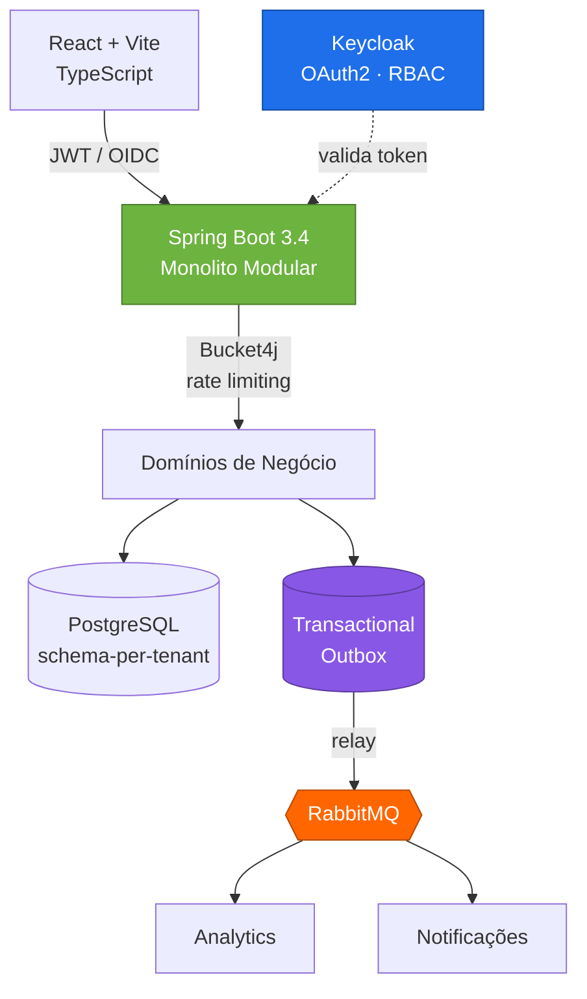
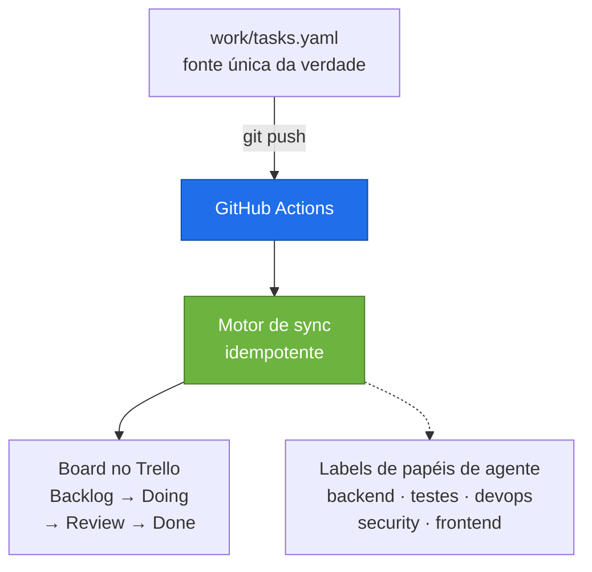

<picture>
  <source media="(prefers-color-scheme: dark)" srcset="assets/banner-dark.svg" />
  <source media="(prefers-color-scheme: light)" srcset="assets/banner-light.svg" />
  
</picture>

  

&nbsp;&nbsp;

  

 

Engenheiro backend com **5+ anos dedicados a Java e ao ecossistema Spring**, dentro de uma trajetória de 10+ anos que começou no suporte de TI.

Hoje construo e mantenho uma **plataforma governamental de alta criticidade usada por todas as vigilâncias sanitárias do Estado de São Paulo**, e arquitetei um **SaaS B2B multi-tenant end-to-end** — do isolamento schema-per-tenant ao pipeline de eventos, OAuth2 e CI/CD.

O que me move: traduzir regras de negócio complexas em arquiteturas que sobrevivem à mudança. Integridade transacional, resiliência e código que o próximo engenheiro consegue manter de verdade.

**5+** anos de Java & Spring&nbsp; · &nbsp;**10+** anos em tecnologia&nbsp; · &nbsp;**100+** representantes atendidos por um sistema que mantive sozinho

 

## O que eu construí

🏛️ &nbsp;**SIVISA** — plataforma de vigilância sanitária do Estado de São Paulo. Alta criticidade, usada por todas as vigilâncias do estado. Desenvolvi o módulo de geração de relatórios e modernizei aplicações legadas em Java / Spring Boot.

📦 &nbsp;**Força de vendas nacional** — o sistema por trás de 100+ representantes comerciais em todo o Brasil, que assumi como **único desenvolvedor da empresa, sem supervisão técnica**.

🚀 &nbsp;**InsightFlow** — SaaS B2B de inteligência de vendas, arquitetado e desenvolvido end-to-end. Multi-tenant com isolamento schema-per-tenant, pipeline assíncrono de eventos e segurança OAuth2. `Repositório privado`

## Aprofundar

<b>&nbsp;🏗️&nbsp; Arquitetura em foco — InsightFlow</b>

 

O problema: atender múltiplas empresas clientes numa só plataforma, com **isolamento rígido de dados**, **entrega confiável de eventos** entre ingestão, analytics e notificações, e **sem dual-write entre banco e broker**.

**Decisões que eu defendo numa entrevista:**

| Decisão | Por quê |
|---|---|
| **Monolito modular** em vez de microsserviços | Fronteiras de domínio sem o overhead de sistemas distribuídos neste estágio. Módulos podem ser extraídos depois — as costuras já existem. |
| **Schema-per-tenant** | Isolamento real no nível do banco, sem o custo operacional de um banco por cliente. |
| **Transactional Outbox** | Elimina o problema de dual-write: o evento é commitado na mesma transação do dado e depois publicado. Sem eventos perdidos ou fantasmas. |
| **Keycloak / OAuth2-OIDC** | Identidade como infraestrutura, não como código de aplicação. RBAC por tenant sem lógica de auth espalhada pelos domínios. |
| **Rate limiting com Bucket4j** | Protege recursos compartilhados: um tenant sozinho não degrada os demais. |
| **Flyway + cache L2 Caffeine** | Migrações versionadas e reprodutíveis em todos os schemas de tenant; cache para reduzir pressão no banco em leituras quentes. |

Billing com `Stripe` · conteinerização com `Docker` · CI/CD em `GitHub Actions` para build, testes e deploy.

<b>&nbsp;🤖&nbsp; Engenharia com agentes de IA</b>

 

Eu não apenas *uso* ferramentas de IA — eu as construo. Meu ângulo é o de engenheiro, não o de usuário: **orquestração, idempotência, tratamento de segredos e pipelines reprodutíveis** aplicados a fluxos de desenvolvimento com agentes.

**Skills autorais de Claude Code** — `trello-init` / `trello-sync`: integração Trello ⇄ Spec-Driven Development que mantém o board de um projeto sincronizado a partir do próprio repositório.

**Decisões de engenharia por trás:**

- **Idempotente por design** — reexecuções convergem para o mesmo estado em vez de duplicar cards; o provisionamento aborta se já existe vínculo, salvo forçado explicitamente.
- **Segredos ficam fora da automação** — o script nunca grava credenciais. Cadastrar os secrets do repositório é um passo manual deliberado; o arquivo de vínculo commitado guarda apenas IDs.
- **Controle de concorrência** — o workflow serializa execuções por ref, então pushes em sequência rápida não competem entre si e corrompem o board.
- **Roda onde o runner enxerga** — motor de sync e workflow são vendorizados no repositório, não na config local do agente, porque o ambiente de execução é o CI.
- **Papéis de agente como labels de primeira classe** — o trabalho é roteado por especialidade (backend, testes, release/devops, revisão de segurança, frontend) em vez de um assistente indiferenciado.

<b>&nbsp;🧰&nbsp; Stack técnica completa</b>

 

**Linguagens & frameworks** — Java 21 · Spring Boot 3 · Spring Security · Spring Data JPA · Hibernate · TypeScript · React · Vite

**Arquitetura & design** — APIs RESTful · Monolito Modular · Arquitetura Hexagonal · Multi-tenancy · Event-Driven · Transactional Outbox · System Design

**Dados & mensageria** — PostgreSQL · Oracle · SQL Server · RabbitMQ · Flyway · Caffeine Cache

**Segurança & autenticação** — Keycloak · OAuth2 / OIDC · JWT · RBAC · Rate limiting com Bucket4j

**DevOps & qualidade** — Docker · GitHub Actions · Maven · Git · JUnit 5 · Mockito · Testcontainers

<b>&nbsp;📈&nbsp; Trajetória & formação</b>

 

**2011–2018 · Ilumi Materiais Elétricos** — estagiário de TI, depois assistente, depois analista de TI e desenvolvedor Java. Terminei assumindo sozinho o sistema de força de vendas nacional.

**2021–hoje · Stefanini Group** — Engenheiro Backend, Java & Spring. SIVISA, a plataforma de vigilância sanitária do Estado de São Paulo.

Uma década subindo do suporte à engenharia. Sei o que quebra em produção porque já fui quem atendia o chamado quando quebrava.

**Formação** — Pós-graduação em Engenharia de Software, PUC Minas (2025) · Tecnólogo em Análise e Desenvolvimento de Sistemas

**Idiomas** — Português (nativo) · Inglês (leitura técnica e compreensão de conversas; fala em desenvolvimento)

 

> A maior parte do meu trabalho vive em repositórios privados e corporativos — sistemas governamentais e código proprietário de SaaS. A arquitetura acima é o retrato honesto do que eu construo.

 

### Vamos conversar

Estou aberto a oportunidades de engenharia backend onde arquitetura, confiabilidade e ownership realmente importam.

