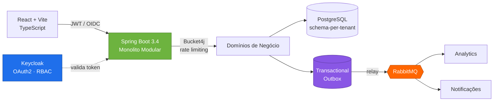
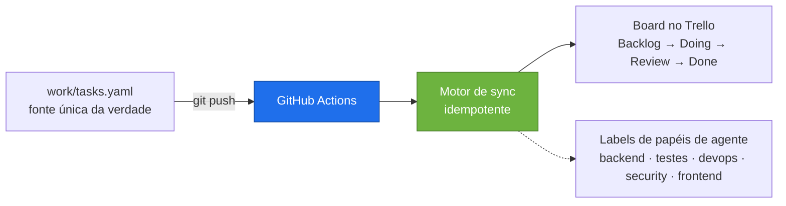

<div align="center">


<a href="README.md"></a>
<a href="README.pt-BR.md"></a>

<br/><br/>


<br/>

<a href="https://www.linkedin.com/in/danilo-franco-852a4841/"></a>
<a href="mailto:danilo.franco90@gmail.com"></a>


</div>

---

## Quem eu sou

Engenheiro backend com **5+ anos dedicados a Java e ao ecossistema Spring**, dentro de uma **trajetória de 10+ anos em TI** — do suporte à engenharia e arquitetura de software.

Hoje construo e mantenho uma **plataforma governamental de alta criticidade usada por todas as vigilâncias sanitárias do Estado de São Paulo**, e arquitetei um **SaaS B2B multi-tenant end-to-end** — do isolamento schema-per-tenant e pipeline assíncrono de eventos até segurança OAuth2 e CI/CD.

O que me move: traduzir regras de negócio complexas em arquiteturas que sobrevivem à mudança. Integridade transacional, resiliência, observabilidade e código que o próximo engenheiro consegue manter de verdade.

---

## O que eu construí

<table>
<tr>
<td width="33%" valign="top">

### 🏛️ SIVISA
**Sistema de Informação em Vigilância Sanitária — Estado de SP**

Plataforma governamental de alta criticidade usada por **todas as vigilâncias sanitárias do estado**. Faço a engenharia e a manutenção, garantindo disponibilidade e integridade dos dados.

Desenvolvi o **módulo de geração de relatórios**, ampliando a capacidade de extração e análise das equipes de vigilância, e modernizei aplicações legadas em Java / Spring Boot para reduzir complexidade.

`Java` `Spring Boot` `Oracle` `REST`

</td>
<td width="33%" valign="top">

### 📦 Força de Vendas Nacional
**Ilumi Materiais Elétricos**

Fui convidado a assumir — como **único desenvolvedor da empresa, sem supervisão técnica** — o sistema de força de vendas usado por **mais de 100 representantes comerciais em todo o Brasil**.

Responsabilidade integral por operação, manutenção e evolução. Desenvolvi rotinas comerciais e financeiras críticas com foco em confiabilidade e integridade transacional.

`Java SE/EE` `SQL Server` `Ownership total`

</td>
<td width="33%" valign="top">

### 🚀 InsightFlow
**SaaS B2B de Inteligência de Vendas** · `Privado`

Projeto autoral, arquitetado e desenvolvido **end-to-end**: plataforma multi-tenant com isolamento schema-per-tenant, pipeline assíncrono de eventos e segurança multi-tenant.

Código proprietário — arquitetura detalhada abaixo.

`Java 21` `Spring Boot 3.4` `RabbitMQ` `Keycloak`

</td>
</tr>
</table>

---

## Arquitetura em foco — InsightFlow

O problema: atender múltiplas empresas clientes numa só plataforma, com **isolamento rígido de dados**, **entrega confiável de eventos** entre ingestão, analytics e notificações, e **sem dual-write entre banco e broker**.



**Decisões que eu defendo numa entrevista:**

| Decisão | Por quê |
|---|---|
| **Monolito modular** em vez de microsserviços | Fronteiras de domínio sem o overhead de sistemas distribuídos neste estágio. Módulos podem ser extraídos depois — as costuras já existem. |
| **Schema-per-tenant** | Isolamento real no nível do banco, sem o custo operacional de um banco por cliente. |
| **Transactional Outbox** | Elimina o problema de dual-write: o evento é commitado na mesma transação do dado e depois publicado. Sem eventos perdidos ou fantasmas. |
| **Keycloak / OAuth2-OIDC** | Identidade como infraestrutura, não como código de aplicação. RBAC por tenant sem lógica de auth espalhada pelos domínios. |
| **Rate limiting com Bucket4j** | Protege recursos compartilhados: um tenant sozinho não degrada os demais. |
| **Flyway + cache L2 Caffeine** | Migrações versionadas e reprodutíveis em todos os schemas de tenant; cache para reduzir pressão no banco em leituras quentes. |

Billing com `Stripe` · conteinerização com `Docker` · CI/CD em `GitHub Actions` para build, testes e deploy.

---

## Engenharia com agentes de IA

Eu não apenas *uso* ferramentas de IA — eu as construo. Meu ângulo é o de engenheiro, não o de usuário: **orquestração, idempotência, tratamento de segredos e pipelines reprodutíveis** aplicados a fluxos de desenvolvimento com agentes.

**Skills autorais de Claude Code** — `trello-init` / `trello-sync`: integração Trello ⇄ Spec-Driven Development que mantém o board de um projeto sincronizado a partir do próprio repositório.



**Decisões de engenharia por trás:**

- **Idempotente por design** — reexecuções convergem para o mesmo estado em vez de duplicar cards; o provisionamento aborta se já existe vínculo, salvo forçado explicitamente.
- **Segredos ficam fora da automação** — o script nunca grava credenciais. Cadastrar os secrets do repositório é um passo manual deliberado; o arquivo de vínculo commitado guarda apenas IDs.
- **Controle de concorrência** — o workflow serializa execuções por ref, então pushes em sequência rápida não competem entre si e corrompem o board.
- **Roda onde o runner enxerga** — motor de sync e workflow são vendorizados no repositório, não na config local do agente, porque o ambiente de execução é o CI.
- **Papéis de agente como labels de primeira classe** — o trabalho é roteado por especialidade (backend, testes, release/devops, revisão de segurança, frontend) em vez de um assistente indiferenciado.

---

## Stack técnica

<div align="center">

**Linguagens & Frameworks**


**Arquitetura & Design**


**Dados & Mensageria**


**Segurança & Autenticação**


**DevOps & Qualidade**


</div>

---

## Trajetória

```
2011 ──── 2012 ──────── 2017 ──── 2018 ──────── 2021 ──── 2021 ─────────────► hoje
  │         │             │         │             │
  Estagiário Assistente   ↓         Analista TI   ↓        Engenheiro Backend
  de TI      de TI                  Java Dev               Java · Spring
  │         │                       │                      │
  └─ Ilumi Materiais Elétricos ─────┴──────────────────────┴─ Stefanini Group
```

Uma década subindo do suporte à engenharia. Sei o que quebra em produção porque já fui quem atendia o chamado quando quebrava.

**Formação**


**Idiomas** — Português (nativo) · Inglês (leitura técnica e compreensão de conversas; fala em desenvolvimento)

---

## GitHub

<p align="center">
  
</p>

> A maior parte do meu trabalho vive em repositórios privados e corporativos — sistemas governamentais e código proprietário de SaaS. A arquitetura acima é o retrato honesto do que eu construo.

---

<div align="center">

### Vamos conversar

Estou aberto a oportunidades de engenharia backend onde arquitetura, confiabilidade e ownership realmente importam.

<a href="https://www.linkedin.com/in/danilo-franco-852a4841/"></a>
<a href="mailto:danilo.franco90@gmail.com"></a>


</div>
